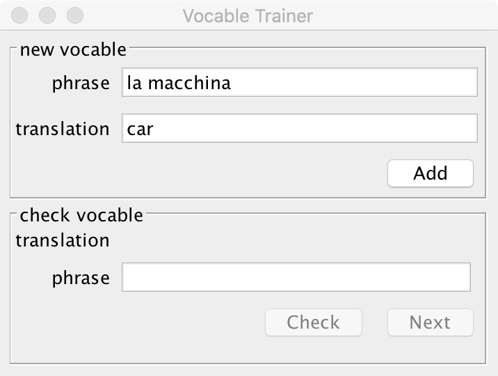

# Report
## The program
The for the project chosen program is a vocable trainer, which can be used for learning vocables in another language by repetitively checking the vocables. The vocables are added to the application providing a phrase in the language to learn and it's translation in the mother tongue. After adding the vocables they can be learned by calling a vocable's translation and entering the corresponding phrase. The given answer will be checked with the phrase of the earlier added vocable and the result will be shown providing information about whether the phrase was correct or incorrect along with the number of correct tries, overall tries and a percentile ratio. After that the next vocable can be checked provided in the order the vocables have been added earlier, starting and also continuing with the first one after checking the last vocable. A new vocable can be added at any time.  
The application can be run with a command line interface or a graphical user interface, depending on an argument given on start up along with some other arguments for internal settings.  

### Console user interface:  


### Graphical user interface:  
 ->   ->
 ->   

## Implementation
### Design and implementation choices
The application has been written in the programming language Java using the model-view-presenter architecture implemented with the following classes:

- The **model** is implemented by the class [Vocable](../myProjects.vocableTrainer/src/main/java/myProjects/vocableTrainer/model/Vocable.java) storing the phrase, it's translation and the number of correct and incorrect tries. The vocable-objects are stored in a database implemented in the wrapper class [H2VocableRepository](../myProjects.vocableTrainer/src/main/java/myProjects/vocableTrainer/repository/h2/H2VocableRepository.java) using the 3rd party library [h2 database](http://www.h2database.com) providing a server-based or in-memory SQL-database.
- The **presenter** implemented by the [TrainerController](../myProjects.vocableTrainer/src/main/java/myProjects/vocableTrainer/controller/TrainerController.java) class is responsible for the program's logic by coordinating the view and the model.  
While adding a [newVocable](../myProjects.vocableTrainer/src/main/java/myProjects/vocableTrainer/controller/TrainerController.java#L20), the controller checks, whether that vocable already exists in the repository. (As a design choice, the phrase has been chosen to be the unique identifier of the vocables.) While learning the controller looks for the vocable in the repository, then [check(s the)VocableOnGivenPhrase](../myProjects.vocableTrainer/src/main/java/myProjects/vocableTrainer/controller/TrainerController.java#L33) and updates the number of tries in the repository. It also provides the view with the [nextVocable](../myProjects.vocableTrainer/src/main/java/myProjects/vocableTrainer/controller/TrainerController.java#L57) following the current vocable.
- The **view** is implemented by the class [ConsoleTrainerView](../myProjects.vocableTrainer/src/main/java/myProjects/vocableTrainer/view/console/ConsoleTrainerView.java) providing the console ui and the class [SwingTrainerView](../myProjects.vocableTrainer/src/main/java/myProjects/vocableTrainer/view/swing/SwingTrainerView.java) providing the GUI using the Java GUI-toolkit swing.

Beside these classes the class [VocableTrainerApp](../myProjects.vocableTrainer/src/main/java/myProjects/vocableTrainer/app/VocableTrainerApp.java), containing the main-method is, called on start up and connects all the collaborators and starts the view. It also  configures the application using the following optional command line arguments:

- `--console`,`-c` use console interface instead of GUI
- `--h2-user` h2 DB username
-	`--h2-password` h2 DB password
-	`--h2-table`,`-t` h2 DB table name
- `--h2-port`,`-p` h2 DB TCP port
-	`--h2-host` h2 DB TCP port
-	`--h2-in-memory`,`-m` h2 DB use in-memory DB
-	`--h2-no-init` h2 DB do not initialize

The command line arguments are being parsed with the library [picocli](https://picocli.info).

### Development and Testing
The application has been written using test-driven development and the testing frameworks **JUnit 4**, **AssertJ (Swing)**, **Awaitility** and **Mockito**.
#### Unit Tests
Starting with [unit tests](../myProjects.vocableTrainer/src/test) the overall specifications of the application have been set and implemented beginning with the class TrainerController, then continuing with the H2VocableRepository, the SwingTrainerView and the ConsoleTrainerView.

For the class Vocable no testing has been used since this is a plain domain model containing mostly fields and getters and setters. Beside these and two functions for incrementing the number of tries, the class has two separate equals-methods, which will be explained [here](./report.md#spying-on-the-vocable-class) in the Problems section.  
Also the class VocableTrainerApp has been excluded from unit tests since this class only connects the collaborators and starts the application so it has been written after all the collaborators have been fully implemented and will be tested with e2e tests.

For unit testing the wrapper class H2VocableRepository an in-memory database has been used for speeding up the tests and so to say mocking a "real" database, which would have to be started and stopped every time.

In every single unit test case all the other collaborators have been mocked to allow independent development and testing. The only exception is again the domain class Vocable, which real implementation is used but spied on in order to verify calls of it's methods.

#### Integration Tests
In the integration tests the individually developed components are tested by interconnecting them and verifying the intended behavior focussing only on the main functionalities leaving out every possible path.  
Starting with [H2VocableRepositoryIT](../myProjects.vocableTrainer/src/it/java/myProjects/vocableTrainer/repository/h2/H2VocableRepositoryIT.java) this time a server-based database running in a Docker container is used. The container is build based on a [Dockerfile](../myProjects.vocableTrainer/Dockerfile), which sets up the h2 database and it's ports, starts before integration testing and stops afterwards.  
The [TrainerControllerIT](../myProjects.vocableTrainer/src/it/java/myProjects/vocableTrainer/controller/TrainerControllerIT.java) tests the integration between the TrainerController and the H2VocableRepository while still mocking the view. This allows for concentrating on these two parts without worrying to much about the view's behavior.  
Next the [SwingTrainerViewIT](../myProjects.vocableTrainer/src/it/java/myProjects/vocableTrainer/view/swing/SwingTrainerViewIT.java) and [ConsoleTrainerViewIT](../myProjects.vocableTrainer/src/it/java/myProjects/vocableTrainer/view/console/ConsoleTrainerViewIT.java) are written testing the integration of all components with the command line UI or GUI. The assertions on this class are being executed by interacting with UI while still using package-private interactions with the class for setting up the test fixture.

#### End-to-End Tests
Finally the whole application is tested in two test cases, one for each UI, interacting with the SUT only via the UI. The test fixture is set up with one already existing Vocable in the repository, this time added manually not reusing the wrapper class which is also part of the SUT. In [SwingTrainerViewE2E](../myProjects.vocableTrainer/src/e2e/java/myProjects/vocableTrainer/app/VocableTrainerAppSwingE2E.java) the GUI is tested starting the application from the command line with some command line arguments.  
The [ConsoleTrainerViewE2E](../myProjects.vocableTrainer/src/e2e/java/myProjects/vocableTrainer/app/VocableTrainerAppConsoleE2E.java) does not start the application from the command line but rather creates an instance of the VocableTrainerApp and runs it in a new thread. This needs to be done in order to get the input and output and interact with the UI. Having two running threads the test asserts the application's output by waiting for the SUT to finish the task and return an output using **Awaitility**.

### Applied techniques and frameworks
The build and automated testing of the application is managed by a **Maven** project. All required steps and settings are configured in the [pom.xml](../myProjects.vocableTrainer/pom.xml) file as following:
- properties
 - the version of all dependencies and plugins are defined
 - the tcp port for the database is defined
 - the SonarCloud plugin is set up
   - exclude the domain model and VocableTrainerApp from coverage
   - include IT and E2E-test reports
   - define which rules to ignore in which classes
- dependencies are defined
- plugins to be run every time are defined and configured
 - build-helper-maven-plugin
   - add IT and E2E tests to test build resources
 - maven-failsafe-plugin
   - execute IT and E2E tests separately
   - hand over tcp port number to tests
 - docker-maven-plugin
   - build Dockerfile and set ports
   - start docker container before IT and E2E tests and stop it afterwards
- plugin management
 - jacoco-maven-plugin
   - exclude the domain model and VocableTrainerApp from coverage
   - prepare agent in phase "initialize"
   - create report in phase "verify"
   - configure coverage goal and check it in phase "verify"
 - coveralls-maven-plugin
   - coverage report is send to coveralls.org
 - pitest-maven
   - perform mutation testing on classes TrainerController, H2VocableRepository and ConsoleTrainerView in phase "verify"
   - define mutators and mutation threshold
 - sonar-maven-plugin
- profiles
 - code-coverage
   - execude jacoco and coveralls
 - jacoco
   - execute jacoco
 - mutation-testing
   - execute pitest

The version control system **git** is used for the development for the project locally in a git repository. This is pushed repeatedly to the web service **gitHub**. Connected to this online git repository is the continuous integration service **Travic CI**.org. Pushing to the gitHub repository or creating pull requests will trigger [Travis CI](https://travis-ci.org/bianik/vocable-trainer) to build the Maven project based on the configuration provided by the [travis.yml](../.travis.yml) file as following:
- the Java JDK is set to 8
- the docker service is started
- SonarCloud is configured
- dependency installation is skipped (because maven will take care of this)
- maven dependencies and sonar files are cached between builds
- the virtual X server is started in order to execute tests on the GUI
- all commits from gitHub are fetched for SonarCloud
- the Maven build is stared using the pom
 - execute the phases "clean" and "verify"
 - use the profiles "code-coverage" and "mutation-testing"
 - execute the goal sonar of the sonar plugin

After the build has finished, code coverage results are send to the online service [Coveralls](https://coveralls.io/github/bianik/vocable-trainer) to log and display them. Also connected to the gitHub online repository is the online service [SonarCloud](https://sonarcloud.io/dashboard?id=myProjects%3AvocableTrainer), which also generates reports on code quality based on some rules. Some of these rules have been deactivated so that they are ignored with the following reasons:

- **e11** "*Tests should include assertions*": SonarCloud does not recognize AssertJ Swing assertions
- **e12** "*Local variable and method parameter names should
  comply with a naming convention*": The WindowBuilder tool autogenerated variable names that don't comply with a naming convention but should be save here.
- **e13** "*Package names should comply with a naming convention*": The chosen project name violates a naming convention. Trying to rename the project and all necessary files afterwards causes more problems and inconsistency than ignoring this rule.
- **e14** "*Inheritance tree of classes should not be too
  deep*": SwingTrainerView extends the class JFrame, which does violate this rule. No non time consuming fix exists so ignoring this rule is acceptable.
- **e15** "*Databases should be password-protected*": Configuring the h2 database with a password on every build has been attempted but couldn't be solved. This is further covered in [Database password](./report.md#database-password).
- **e16** "*Standard outputs should not be used directly to
  log anything*": The standard output is used by the console UI so this rule can be ignored here.

### Problems
During implementing the application the following problems occurred. Some of them could be solved.
#### Testing the console line interface
The console UI interacts with the user via text input and output. In order to test this, the console UI needs to be acted upon to enter text and read the output. Other than the GUI, which was tested by using the testing framework AssertJ Swing to look for specific elements and interact with the GUI, such a testing framework couldn't be found for console user interfaces.  
This problem was solved by redirecting the input and output of the class ConsoleTrainerView to the test classes. Therefore the constructor of the class ConsoleTrainerView accepts a Scanner as a text input and a PrintStream as a text output, which are provided by the test classes. The only disadvantage of of this method is the timing. At the beginning of a test the whole user input text needs to be handed over to the SUT and only after exercising on the SUT the output is handed back to the test for assertion. This means that while writing the tests you need to remember the order of the input and output and you also need to trust the SUT to read in the next part of the input and give the output at the right time. When running the application after testing the ConsoleTrainerView is handed over the `System.in` and `System.out` streams to output on a real console.

#### Spying on the Vocable class
I think that this problem is quite an interesting one so I wrote a bit more about the way I found the problem and also it's solution. (The links direct to the appropriate commit.)

The test class TrainerControllerTest uses real instances of the domain model Vocable and spies on them to check, whether actions are performed on them. These Vocable objects are handed over to the SUT class TrainerController, which needs to compare two Vocable objects on equality in the method `checkVocableOnGivenPhrase`.  
Looking at the [implementation of this method in this commit](https://github.com/bianik/vocable-trainer/blob/f491d334610c4e039dfb8e9aedc5f0555ab96f3c/myProjects.vocableTrainer/src/main/java/myProjects/vocableTrainer/controller/TrainerController.java) it should make all Tests pass. But this is not the case. I couldn't explain this behavior so by having a look at the code coverage, I figured out the following:

The true-branch of the [if-statement](https://github.com/bianik/vocable-trainer/blob/f491d334610c4e039dfb8e9aedc5f0555ab96f3c/myProjects.vocableTrainer/src/main/java/myProjects/vocableTrainer/controller/TrainerController.java#L28) in checkVocableOnGivenPhrase is never been executed. This makes the test [testCheckVocableOnGivenPhraseWhenCorrectPhrase](https://github.com/bianik/vocable-trainer/blob/f491d334610c4e039dfb8e9aedc5f0555ab96f3c/myProjects.vocableTrainer/src/test/java/myProjects/vocableTrainer/controller/TrainerControllerTest.java#L63) fail. The branch not getting executed is caused by the statement `correctVocable.equals(vocableToCheck)` always returning as false. Having a look at the code coverage of the autogenerated equals-function of Vocable shows that the if-statement [`if (getClass() != obj.getClass())`](https://github.com/bianik/vocable-trainer/blob/f491d334610c4e039dfb8e9aedc5f0555ab96f3c/myProjects.vocableTrainer/src/main/java/myProjects/vocableTrainer/model/Vocable.java#L76) returns true and makes the equals-function return false.
This is caused by the fact, that the Object "correctVocable" is being spied on by Mockito.
As stated in the javadoc-file of the spy-method, not an object of the class Vocable gets created, but a **spied-on copy from another mockito-class** while the spy still calls the real (not stubbed) methods of the object of the class Vocable:

>„[Spy] Creates a spy of the real object. The spy calls real methods unless they are stubbed.“

This is a problem, since the getClass()-functions in the equals-function will not return the class Vocable.
Even worse is the fact, that the other test [testCheckVocableOnGivenPhraseWhenIncorrectPhrase](https://github.com/bianik/vocable-trainer/blob/f491d334610c4e039dfb8e9aedc5f0555ab96f3c/myProjects.vocableTrainer/src/test/java/myProjects/vocableTrainer/controller/TrainerControllerTest.java#L79) now always passes even with correct phrases, which makes it now a false positive test!

Modifying the if-statement from `vocableToCheck.equals(correctVocable)` to `correctVocable.equals(vocableToCheck)`, so turning it around, doesn’t help. Also spying on the other Vocable-object "vocableToCheck" doesn’t help either.

A possible solution would be to not spy on the object an verify the incrementation of the counter of the Vocable object by calling `getCorrTries()`. As mentioned in your book, this solution isn’t as fine as verifying, that the incrementation has been done by the appropriate function `incCorrTries()`.

Another solution could be by keeping reference to the real Vocable-object:
```java
Vocable correctVocable = new Vocable(PHRASE, TRANSLATION);
Vocable spiedCorrectVocable = spy(correctVocable);
when(spiedCorrectVocable.equals(vocableToCheck)).thenReturn(correctVocable.equals(vocableToCheck));
```

Unfortunately the following failure by Mockito shows up:
>„Also, this error might show up because:  
1\. you stub either of: final/private/equals()/hashCode() methods.
Those methods *cannot* be stubbed/verified.
Mocking methods declared on non-public parent classes is not supported.“

The solution I will go for is the one to create a new method in the class Vocable [`Vocable compareTo(Vocable other)`](../myProjects.vocableTrainer/src/main/java/myProjects/vocableTrainer/model/Vocable.java#L64).
This solution isn’t my preferred one, because now I have a self-implemented, so not autogenerated function in my model class (in addition to the increment-methods), which means, that my model class contains some kind of logic, which would need to be tested by unit tests. I am confident enough in this small code and do not to write tests for it.

#### Database password
In this [line](../myProjects.vocableTrainer/src/main/java/myProjects/vocableTrainer/app/VocableTrainerApp.java#L56) SonarCloud suggested to protect the database with a password. Since the database is running on an external server in a Docker container, which will be build and executed on every build (on Travis CI), the password would be needed to be set up on every build. I tried to do this in this [Dockerfile](./Dockerfile_h2password), by starting the server during the build of the container, trying to execute the SQL command on the database to change a user's password and then stopping the server again. Unfortunately this does not work because calling the localhost inside a Docker container seems to be not that easy.  
I ended up not protecting the database with a password and ignored the rule from SonarCloud.
